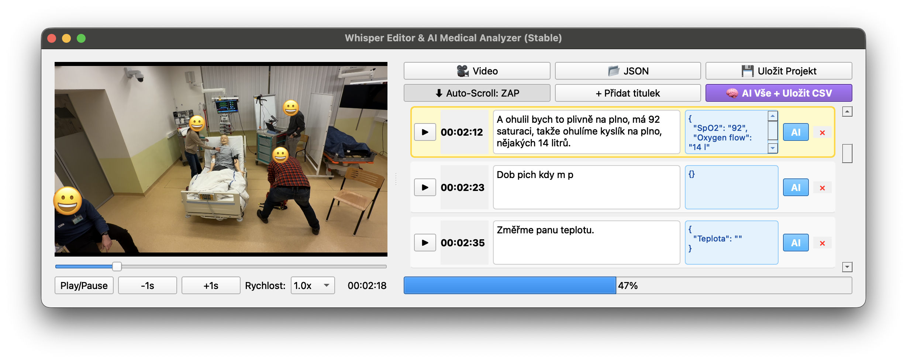

# 🏥 Automonitoring with AI

Inteligentní monitorovací systém se zpracováním hlasu pomocí AI.

Tento projekt si klade za cíl vytvořit systém pro automatizovaný záznam ústně sdělovaných klinických dat během resuscitace — tedy převést ústně řečené informace (rozhovor, rozhodnutí, podání léků, zásahy, časové okamžiky) do strukturované podoby vhodné pro analýzu či pozdější zpětné hodnocení. Jde o reakci na problém, že při akutním zásahu bývá zápis často ruční, nepřehledný nebo se může stát, že některé důležité detaily uniknou. Automatizace pomocí AI a rozpoznávání řeči má potenciál snížit administrativní zátěž, snížit chyby přepisu a umožnit rychlý, přesný a konzistentní záznam — což je přínosné pro zpětnou analýzu, výzkum i zlepšení kvality péče.

Současně je projekt koncipovaný jako modulární a flexibilní: existuje „plná“ (offline, s možností nahrávání audia a skládání dat lokálně) i “lite”-verze (webová, běžící kompletně na serverech, bez možnosti lokálního modelu či uložení audia), které se liší především způsobem zpracování a ukládání dat. Tímto způsobem umožňuje projekt jednodušší nasazení pro testování, simulace nebo demonstrace funkčnosti, zároveň ale dává možnost přejít k robustnějšímu, zabezpečenému řešení. Cílem je, aby výstupem byla co nejpřehlednější, strukturovaná data, připravená pro analýzu, případnou automatizovanou reportaci nebo integraci do klinických systémů.

## 📊 Architektura systému

```
🎤 Mikrofon
   ↓
🔊 ASR (Vosk, Whisper, Groq)
   ↓
📄 Text
   ↓
🧠 LLM (Ollama: gemma3, deepseek-r1)
   ↓
📦 JSON struktura
   ↓
🌐 Web Dashboard (Real-time)
   ↓
📈 CSV Export + Timestamps
```


Detailnější popis
```
[🎤 Mikrofon] - detekce ukončení řeči/uplynutý maximální čas pro jeden příkaz
      ↓ (WAV)
[Flask API /api/process_audio]
      ↓
---------------------------------------------------------
| 1. TRANSKRIPCE (Groq Cloud)                           |
|     ↙                        ↘                        |
| [☁️ONLINE:Groq-Whisper]     [💻LOKÁLNÍ: vosk]         |
|     ↘                           ↙                     |
|   [📄 TEXTOVÝ PŘEPIS] "Pacient má tep 80...            |
---------------------------------------------------------
      ↓
---------------------------------------------------------
| 2. LLM ROUTER (Výběr modelu dle nastavení)            |
|     ↙                   ↘                             |
| [☁️ONLINE:Groq/GEMINI]    [💻LOKÁLNÍ: Ollama]         |
|     ↘                   ↙                             |
|      [📦 JSON: {"tep": "80"}]                         |
---------------------------------------------------------
      ↓
---------------------------------------------------------
| 3. PYTHON BACKEND (Logika)                            |
| [🔄Normalizace] "tep" -> "Srdeční frekvence"          |
|      ↓                                                |
| [📂Kategorizace]: DrABCDE, Medication, Other...       |
|      ↓                                                |
| [Rozdělení dat]                                       |
|  ├─> [❤️ Vitální funkce] (pro horní lištu)            |
|  └─> [📂 Tabulky DrABCDE] (pro hlavní zobrazení)      |
---------------------------------------------------------
      ↓
---------------------------------------------------------
| 4. UKLÁDÁNÍ   (pouze Vercel verze)                    |
| [RAM: Pandas DataFrame] -> [Disk: CSV soubory v /tmp] |
---------------------------------------------------------
    ↓                                     ↓
[💾 Uložení CSV do /sessions]     [🌐 SocketIO Push]
                                          ↓
                                 [🖥️ WEB DASHBOARD]
 
 
```


---

## Progresivní Webová Aplikace (PWA)

Tento projekt je vytvořen jako **Progressive Web App (PWA)**. To znamená, že se chová podobně jako nativní aplikace, ale běží přímo ve webovém prohlížeči. Uživatelé si aplikaci mohou **nainstalovat na plochu nebo domovskou obrazovku** a získat rychlý, responzivní a „app-like“ zážitek bez nutnosti instalace z App Store či Google Play.

PWA využívá moderní webové technologie, jako jsou **Service Workers** a **Web App Manifest**, které umožňují:
- instalaci aplikace na zařízení,
- cacheování dat a offline režim,
- rychlé načítání a lepší výkon,
- jednotné chování napříč platformami (desktop i mobil).

Pro generování favicon (ikonky webu a PWA) používáme **RealFaviconGenerator** – online nástroj, který vytvoří všechny potřebné ikony pro různé prohlížeče, platformy a zařízení z jednoho vstupního obrázku 📱💻.  [oai_citation:0‡Real Favicon Generator](https://realfavicongenerator.net/?utm_source=chatgpt.com)

---

# Dotazník


# Simulační studie

Potvrzení/vyvrácení domněnek - výhody/nevýhody řešení.

Byl vytvořen program pro zpětnou analýzu videa. Program dokáže vytvářet titulky - nabízí prostředí, kde pohodně člověk manuálně přepisuje ze záznamu a získáním referenčního přepisu můžemě srovnat s AI přepisem. Dále nabízí i analýzu pomocí AI a extrakci dat z přepisu (jako hlavní program). Dovoluje nám to testovat různé přepisy pro extrakci dat do tabulek. 



# Technické detaily

## 🚀 Rychlý start

### Instalace Ollama

1. Stáhni [Ollama](https://ollama.com/download)
2. Nainstaluj model:
   ```bash
   ollama run gemma3
   ```

**Dostupné modely:**
| Model | Velikost | VRAM | Rychlost |
|-------|----------|------|----------|
| gemma3:1b | 815 MB | ~1 GB | Nejrychlejší ⚡ |
| gemma3:4b | 4.4 GB | ~2 GB | Vyvážené |
| deepseek-r1:1.5b | 1.1 GB | ~1 GB | Rychlé 🚀 |

Zobrazit nainstalované modely:
```bash
ollama list
```

---

## 🐍 Python Virtual Environment

```bash
# 1. Vytvoř složku
mkdir mujprojekt && cd mujprojekt

# 2. Virtuální prostředí
python3 -m venv venv

# 3. Aktivuj
source venv312/bin/activate

# 4. Instaluj balíčky
pip install -r requirements.txt

# 5. Ulož závislosti (volitelné)
pip freeze > requirements.txt

# 6. Deaktivuj
deactivit
```

---

## 🎙️ Whisper (ASR)

[Whisper - OpenAI Speech Recognition](https://github.com/openai/whisper)

### Parametry modelů

| Model | Parametry | Vyžadován VRAM | Rychlost |
|-------|-----------|---|----------|
| tiny | 39 M | ~1 GB | 10x |
| base | 74 M | ~1 GB | 7x |
| small | 244 M | ~2 GB | 4x |
| medium | 769 M | ~5 GB | 2x |
| large | 1550 M | ~10 GB | 1x |
| turbo | 809 M | ~6 GB | 8x |

### Instalace

```bash
pip install git+https://github.com/openai/whisper.git
pip install pyaudio numpy
```

### Funkcionalita

- ✅ Záznam zvuku každých 5 sekund (nastavitelné)
- ✅ Dočasné uložení jako `.wav` soubory
- ✅ Transkripce textu
- ✅ Výstup do konzole

### Plánovaná vylepšení

- 🔄 Voice Activity Detection (VAD)
- ⏱️ Timestamps (časové značky)
- 📊 Metadata

**Poznámka:** Whisper defaultně používá FP16 pro rychlejší výpočty.

---

## 🎵 Vosk (Offline ASR)

Alternativa k Whisper - offline rozpoznávání řeči.

- 📦 [Vosk Toolkit](https://alphacephei.com/vosk/)
- 🗣️ [Vosk Models](https://alphacephei.com/vosk/models)

```bash
pip install vosk
```

### Konverze audio formátu

```bash
ffmpeg -i input_audio.wav -ac 1 -ar 16000 -acodec pcm_s16le converted_audio.wav
```

---

## 🔗 Groq API (Cloud LLM)

Cloudové LLM zpracování - rychlejší alternativa.

- 🌐 [Groq Console](https://console.groq.com/)

```bash
pip install groq

# Nastav API klíč
export GROQ_API_KEY=tvuj-api-klic
```

---

## 🔗 Google AI Studio

Cloudové LLM zpracování

- 🌐 [Google AI Studio](https://ai.google.dev/gemini-api/docs/)

```bash
pip install -q -U google-genai

# Nastav API klíč
export GOOGLE_API_KEY=tvuj-api-klic
```

---

## 📁 Git Ignore

Systém ignoruje:

```
recordings/
logs/
venv/
.env
```

---

## 📝 Licence

MIT

## 👤 Autor

Jakub Vavra